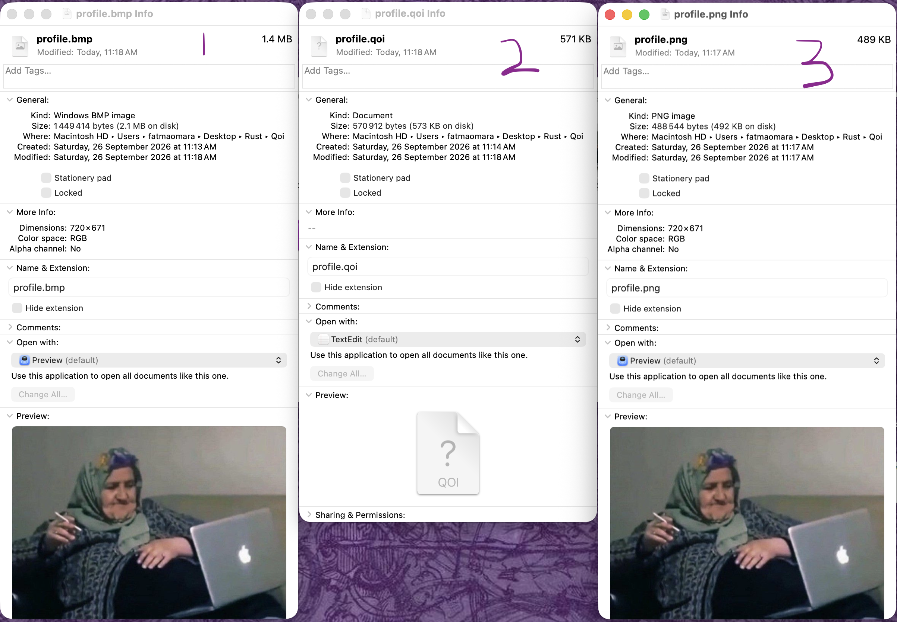

# QOI Encoder/Decoder in Rust

## Overview
[Quite OK Image](https://qoiformat.org) format is a lossless image compression algorithm achieving a similar size to PNG, while offering 20x-50x faster encoding and 3x-4x faster decoding. Originally written in C, this is a Rust implementation built for practice purposes.
### Demo
  

https://github.com/user-attachments/assets/2e1eedf8-837a-4c97-af38-37a82fdbef4c


## Usage

### Clone the repo

```bash
git clone https://github.com/ftomara/Qoi.git
cd Qoi
```

### Prerequisites

Install Rust via [rustup](https://rustup.rs):

```bash
curl --proto '=https' --tlsv1.2 -sSf https://sh.rustup.rs | sh
```

### Running

```bash
# Build a release binary
cargo build --release

# Or install it so `qoi` is available anywhere in your terminal
cargo install --path .

# Encode a PNG/JPEG image into .qoi
qoi encode image.png

# Decode a .qoi file back into a .png
qoi decode image.qoi
```

## Before/After Examples

- 1 is input bmp image with 1.4 MB
- 2 is encoder output file with 571 KB
- 3 is decoder output png file which looks exactly like the original no lost data and the difference in size is only 82 KB
